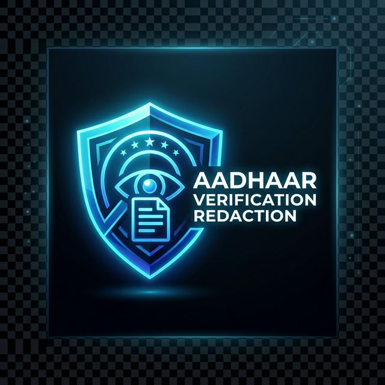

<p align="center">
  
</p>

# 🔒 Aadhaar Redaction System

<p align="center">
  <i>An AI-powered document verification and redaction tool protecting sensitive PII (Personally Identifiable Information).</i>
</p>

<p align="center">
  
</p>

## 🚀 Overview

The **Aadhaar Redaction System** is a high-performance tool built to automatically detect and obscure Aadhaar numbers from scanned identity documents. Using a custom-trained **YOLOv8** model augmented with **Tesseract OCR**, this system operates seamlessly on images, batches of files, and live webcam feeds. It also features a clean, user-friendly UI built with **Streamlit**.

## ✨ Key Features

- **Automated Detection:** Localizes Aadhaar numbers rapidly using Ultralytics YOLOv8.
- **Intelligent Redaction:** Black-boxes sensitive digits while strategically keeping the last four digits visible (adjustable).
- **Batch Processing:** Scripts to process entire folders of incoming documents at once.
- **Fast Web UI:** Launch the visual interface with a single command to redact via file upload or real-time webcam feed.
- **Privacy-First:** All processing is done locally; no data ever leaves your device.

## 🛠️ Technology Stack

- **Python 3.8+**
- **YOLOv8** (Ultralytics) for high-accuracy bounding box regression
- **Tesseract OCR / OpenCV** for precise image preprocessing and text extraction
- **Streamlit** for rapid UI deployment

## ⚙️ Quickstart Setup

### 1. Install Dependencies
Ensure you have Python installed, then run the following in your terminal:

```bash
pip install -r requirements.txt
```

### 2. Prepare the Model
The repository comes configured out of the box. Ensure your YOLOv8 weights are located at `yolo8_model/best.pt`. (Paths can also be configured dynamically within the Streamlit sidebar).

### 3. Run the Web Application
Launch the interactive Streamlit dashboard:

```bash
streamlit run app.py
```

## 📚 Usage Guide

### Streamlit Interface
- **Upload Image:** Select a local `.png`, `.jpg`, or `.webp` file. The app will immediately display the redacted output and provide a download link.
- **Live Webcam:** Toggle webcam mode to identify and redact Aadhaar numbers on the fly in real-time.

### CLI Batch Processing
To redact an entire directory of images, place your files inside the `Dataset` folder and run the standalone core logic:

```bash
python YOLO.py
# or using OCR logic
python redaction.py
```
Output results will be generated into the `Result_redaction` folder alongside a processing log (`aadhaar_redaction_log.json`).

---
<p align="center">
  <b>Secure • Efficient • Automated</b>
</p>
